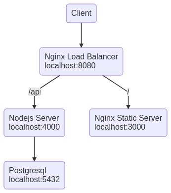

## Infrastructure Schema



## Run full stack

```sh
docker-compose -f docker-compose.stack.yaml -f docker-compose.app.yaml build
docker-compose -f docker-compose.stack.yaml -f docker-compose.app.yaml up -d
```

## Dev workflow

```sh
docker-compose -f docker-compose.stack.yaml up -d

## run server in dev mode with node 10
cd server
npm install
npm start
npm run fixtures

## run client in dev mode with node 10
cd client
npm install
npm start
```
